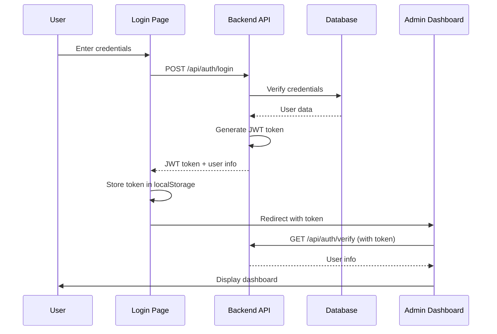
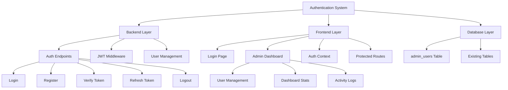

# Authentication System Implementation Plan

## Executive Summary

This document outlines a comprehensive plan to implement a JWT-based authentication system for the MediAI medical application. The system will include a login page, admin dashboard, and user management functionality while maintaining design consistency with the existing medical theme (mint green, white, beige, light pink with glassmorphism effects).

## Table of Contents

1. [System Architecture](#system-architecture)
2. [Database Schema](#database-schema)
3. [Backend Implementation](#backend-implementation)
4. [Frontend Implementation](#frontend-implementation)
5. [Security Considerations](#security-considerations)
6. [Testing Strategy](#testing-strategy)
7. [Deployment Checklist](#deployment-checklist)

---

## 1. System Architecture

### 1.1 Authentication Flow



### 1.2 Component Architecture



---

## 2. Database Schema

### 2.1 New Table: `admin_users`

Create a new table separate from the existing `users` table (which is for patient records).

```sql
CREATE TABLE admin_users (
    id INTEGER PRIMARY KEY AUTOINCREMENT,
    username VARCHAR(50) UNIQUE NOT NULL,
    email VARCHAR(255) UNIQUE NOT NULL,
    hashed_password VARCHAR(255) NOT NULL,
    full_name VARCHAR(255) NOT NULL,
    role VARCHAR(20) NOT NULL DEFAULT 'doctor',  -- 'admin' or 'doctor'
    department VARCHAR(100),
    is_active BOOLEAN DEFAULT TRUE,
    created_at TIMESTAMP DEFAULT CURRENT_TIMESTAMP,
    updated_at TIMESTAMP DEFAULT CURRENT_TIMESTAMP,
    last_login TIMESTAMP
);

-- Create indexes for performance
CREATE INDEX idx_admin_users_username ON admin_users(username);
CREATE INDEX idx_admin_users_email ON admin_users(email);
CREATE INDEX idx_admin_users_role ON admin_users(role);
```

### 2.2 Migration Script

Create a new Alembic migration file: `backend/alembic/versions/xxx_add_admin_users_table.py`

```python
from alembic import op
import sqlalchemy as sa

def upgrade():
    op.create_table(
        'admin_users',
        sa.Column('id', sa.Integer(), primary_key=True, autoincrement=True),
        sa.Column('username', sa.String(50), nullable=False, unique=True),
        sa.Column('email', sa.String(255), nullable=False, unique=True),
        sa.Column('hashed_password', sa.String(255), nullable=False),
        sa.Column('full_name', sa.String(255), nullable=False),
        sa.Column('role', sa.String(20), nullable=False, default='doctor'),
        sa.Column('department', sa.String(100), nullable=True),
        sa.Column('is_active', sa.Boolean(), default=True),
        sa.Column('created_at', sa.TIMESTAMP(), server_default=sa.func.now()),
        sa.Column('updated_at', sa.TIMESTAMP(), server_default=sa.func.now(), onupdate=sa.func.now()),
        sa.Column('last_login', sa.TIMESTAMP(), nullable=True)
    )
    op.create_index('idx_admin_users_username', 'admin_users', ['username'])
    op.create_index('idx_admin_users_email', 'admin_users', ['email'])
    op.create_index('idx_admin_users_role', 'admin_users', ['role'])

def downgrade():
    op.drop_index('idx_admin_users_role', 'admin_users')
    op.drop_index('idx_admin_users_email', 'admin_users')
    op.drop_index('idx_admin_users_username', 'admin_users')
    op.drop_table('admin_users')
```

### 2.3 Default Admin Account

Create a seed script to insert the default admin account:

```python
# backend/seed_admin.py
from database import SessionLocal, engine, Base
from models import AdminUser
from passlib.context import CryptContext
import os
from dotenv import load_dotenv

load_dotenv()

pwd_context = CryptContext(schemes=["bcrypt"], deprecated="auto")

def create_default_admin():
    db = SessionLocal()
    try:
        # Check if admin already exists
        existing_admin = db.query(AdminUser).filter(AdminUser.username == "admin").first()
        if existing_admin:
            print("Default admin already exists")
            return
        
        # Create default admin
        default_password = os.getenv("DEFAULT_ADMIN_PASSWORD", "admin123")
        hashed_password = pwd_context.hash(default_password)
        
        admin = AdminUser(
            username="admin",
            email="admin@medai.com",
            hashed_password=hashed_password,
            full_name="System Administrator",
            role="admin",
            department="IT",
            is_active=True
        )
        
        db.add(admin)
        db.commit()
        print(f"Default admin created successfully!")
        print(f"Username: admin")
        print(f"Password: {default_password}")
        print(f"IMPORTANT: Change this password after first login!")
        
    except Exception as e:
        print(f"Error creating default admin: {e}")
        db.rollback()
    finally:
        db.close()

if __name__ == "__main__":
    create_default_admin()
```

---

## 3. Backend Implementation

### 3.1 Required Dependencies

Add to `backend/requirements.txt`:

```
python-jose[cryptography]>=3.3.0
passlib[bcrypt]>=1.7.4
python-multipart>=0.0.6
```

### 3.2 Update Models

Add to `backend/models.py`:

```python
class AdminUser(Base):
    __tablename__ = "admin_users"

    id = Column(Integer, primary_key=True, index=True)
    username = Column(String(50), unique=True, nullable=False)
    email = Column(String(255), unique=True, nullable=False)
    hashed_password = Column(String(255), nullable=False)
    full_name = Column(String(255), nullable=False)
    role = Column(String(20), nullable=False, default="doctor")  # admin, doctor
    department = Column(String(100), nullable=True)
    is_active = Column(Boolean, default=True)
    created_at = Column(DateTime(timezone=True), server_default=func.now())
    updated_at = Column(DateTime(timezone=True), server_default=func.now(), onupdate=func.now())
    last_login = Column(DateTime(timezone=True), nullable=True)
```

### 3.3 Authentication Utilities

Create `backend/auth.py`:

```python
from datetime import datetime, timedelta
from typing import Optional
from jose import JWTError, jwt
from passlib.context import CryptContext
from fastapi import Depends, HTTPException, status
from fastapi.security import OAuth2PasswordBearer
from sqlalchemy.orm import Session
from database import get_db
from models import AdminUser
import os
from dotenv import load_dotenv

load_dotenv()

# Security configuration
SECRET_KEY = os.getenv("JWT_SECRET_KEY", "your-secret-key-change-in-production")
ALGORITHM = "HS256"
ACCESS_TOKEN_EXPIRE_MINUTES = int(os.getenv("ACCESS_TOKEN_EXPIRE_MINUTES", "30"))

pwd_context = CryptContext(schemes=["bcrypt"], deprecated="auto")
oauth2_scheme = OAuth2PasswordBearer(tokenUrl="/api/auth/login")

def verify_password(plain_password: str, hashed_password: str) -> bool:
    """Verify a plain password against a hashed password."""
    return pwd_context.verify(plain_password, hashed_password)

def get_password_hash(password: str) -> str:
    """Hash a password."""
    return pwd_context.hash(password)

def create_access_token(data: dict, expires_delta: Optional[timedelta] = None) -> str:
    """Create a JWT access token."""
    to_encode = data.copy()
    if expires_delta:
        expire = datetime.utcnow() + expires_delta
    else:
        expire = datetime.utcnow() + timedelta(minutes=ACCESS_TOKEN_EXPIRE_MINUTES)
    
    to_encode.update({"exp": expire})
    encoded_jwt = jwt.encode(to_encode, SECRET_KEY, algorithm=ALGORITHM)
    return encoded_jwt

def decode_access_token(token: str) -> Optional[dict]:
    """Decode and verify a JWT access token."""
    try:
        payload = jwt.decode(token, SECRET_KEY, algorithms=[ALGORITHM])
        return payload
    except JWTError:
        return None

async def get_current_user(
    token: str = Depends(oauth2_scheme),
    db: Session = Depends(get_db)
) -> AdminUser:
    """Get the current authenticated user from JWT token."""
    credentials_exception = HTTPException(
        status_code=status.HTTP_401_UNAUTHORIZED,
        detail="Could not validate credentials",
        headers={"WWW-Authenticate": "Bearer"},
    )
    
    payload = decode_access_token(token)
    if payload is None:
        raise credentials_exception
    
    username: str = payload.get("sub")
    if username is None:
        raise credentials_exception
    
    user = db.query(AdminUser).filter(AdminUser.username == username).first()
    if user is None:
        raise credentials_exception
    
    if not user.is_active:
        raise HTTPException(
            status_code=status.HTTP_403_FORBIDDEN,
            detail="User account is inactive"
        )
    
    return user

async def get_current_active_admin(
    current_user: AdminUser = Depends(get_current_user)
) -> AdminUser:
    """Get the current authenticated admin user."""
    if current_user.role != "admin":
        raise HTTPException(
            status_code=status.HTTP_403_FORBIDDEN,
            detail="Not enough permissions"
        )
    return current_user
```

### 3.4 Authentication Endpoints

Create `backend/auth_routes.py`:

```python
from fastapi import APIRouter, Depends, HTTPException, status
from fastapi.security import OAuth2PasswordRequestForm
from sqlalchemy.orm import Session
from pydantic import BaseModel, EmailStr
from typing import Optional
from datetime import datetime
from database import get_db
from models import AdminUser
from auth import (
    verify_password,
    get_password_hash,
    create_access_token,
    get_current_user,
    get_current_active_admin
)

router = APIRouter(prefix="/api/auth", tags=["Authentication"])

# Pydantic models
class Token(BaseModel):
    access_token: str
    token_type: str
    user: dict

class UserLogin(BaseModel):
    username: str
    password: str

class UserRegister(BaseModel):
    username: str
    email: EmailStr
    password: str
    full_name: str
    department: Optional[str] = None

class UserResponse(BaseModel):
    id: int
    username: str
    email: str
    full_name: str
    role: str
    department: Optional[str]
    is_active: bool

class UserCreate(BaseModel):
    username: str
    email: EmailStr
    password: str
    full_name: str
    role: str = "doctor"
    department: Optional[str] = None

@router.post("/login", response_model=Token)
async def login(
    form_data: OAuth2PasswordRequestForm = Depends(),
    db: Session = Depends(get_db)
):
    """Authenticate user and return JWT token."""
    user = db.query(AdminUser).filter(AdminUser.username == form_data.username).first()
    
    if not user or not verify_password(form_data.password, user.hashed_password):
        raise HTTPException(
            status_code=status.HTTP_401_UNAUTHORIZED,
            detail="Incorrect username or password",
            headers={"WWW-Authenticate": "Bearer"},
        )
    
    if not user.is_active:
        raise HTTPException(
            status_code=status.HTTP_403_FORBIDDEN,
            detail="User account is inactive"
        )
    
    # Update last login
    user.last_login = datetime.utcnow()
    db.commit()
    
    # Create access token
    access_token = create_access_token(data={"sub": user.username})
    
    return {
        "access_token": access_token,
        "token_type": "bearer",
        "user": {
            "id": user.id,
            "username": user.username,
            "email": user.email,
            "full_name": user.full_name,
            "role": user.role,
            "department": user.department
        }
    }

@router.post("/verify")
async def verify_token(current_user: AdminUser = Depends(get_current_user)):
    """Verify JWT token and return user info."""
    return {
        "valid": True,
        "user": {
            "id": current_user.id,
            "username": current_user.username,
            "email": current_user.email,
            "full_name": current_user.full_name,
            "role": current_user.role,
            "department": current_user.department
        }
    }

@router.get("/me", response_model=UserResponse)
async def get_current_user_info(current_user: AdminUser = Depends(get_current_user)):
    """Get current user information."""
    return UserResponse(
        id=current_user.id,
        username=current_user.username,
        email=current_user.email,
        full_name=current_user.full_name,
        role=current_user.role,
        department=current_user.department,
        is_active=current_user.is_active
    )

@router.post("/users", response_model=UserResponse)
async def create_user(
    user_data: UserCreate,
    current_admin: AdminUser = Depends(get_current_active_admin),
    db: Session = Depends(get_db)
):
    """Create a new user (admin only)."""
    # Check if username or email already exists
    existing_user = db.query(AdminUser).filter(
        (AdminUser.username == user_data.username) | 
        (AdminUser.email == user_data.email)
    ).first()
    
    if existing_user:
        raise HTTPException(
            status_code=status.HTTP_400_BAD_REQUEST,
            detail="Username or email already exists"
        )
    
    # Validate role
    if user_data.role not in ["admin", "doctor"]:
        raise HTTPException(
            status_code=status.HTTP_400_BAD_REQUEST,
            detail="Invalid role. Must be 'admin' or 'doctor'"
        )
    
    # Create new user
    new_user = AdminUser(
        username=user_data.username,
        email=user_data.email,
        hashed_password=get_password_hash(user_data.password),
        full_name=user_data.full_name,
        role=user_data.role,
        department=user_data.department,
        is_active=True
    )
    
    db.add(new_user)
    db.commit()
    db.refresh(new_user)
    
    return UserResponse(
        id=new_user.id,
        username=new_user.username,
        email=new_user.email,
        full_name=new_user.full_name,
        role=new_user.role,
        department=new_user.department,
        is_active=new_user.is_active
    )

@router.get("/users")
async def list_users(
    current_admin: AdminUser = Depends(get_current_active_admin),
    db: Session = Depends(get_db)
):
    """List all users (admin only)."""
    users = db.query(AdminUser).all()
    return {
        "users": [
            {
                "id": user.id,
                "username": user.username,
                "email": user.email,
                "full_name": user.full_name,
                "role": user.role,
                "department": user.department,
                "is_active": user.is_active,
                "created_at": user.created_at.isoformat() if user.created_at else None,
                "last_login": user.last_login.isoformat() if user.last_login else None
            }
            for user in users
        ]
    }

@router.put("/users/{user_id}")
async def update_user(
    user_id: int,
    user_data: dict,
    current_admin: AdminUser = Depends(get_current_active_admin),
    db: Session = Depends(get_db)
):
    """Update user information (admin only)."""
    user = db.query(AdminUser).filter(AdminUser.id == user_id).first()
    
    if not user:
        raise HTTPException(
            status_code=status.HTTP_404_NOT_FOUND,
            detail="User not found"
        )
    
    # Update fields
    if "full_name" in user_data:
        user.full_name = user_data["full_name"]
    if "email" in user_data:
        user.email = user_data["email"]
    if "department" in user_data:
        user.department = user_data["department"]
    if "role" in user_data:
        if user_data["role"] not in ["admin", "doctor"]:
            raise HTTPException(
                status_code=status.HTTP_400_BAD_REQUEST,
                detail="Invalid role"
            )
        user.role = user_data["role"]
    if "is_active" in user_data:
        user.is_active = user_data["is_active"]
    if "password" in user_data:
        user.hashed_password = get_password_hash(user_data["password"])
    
    db.commit()
    db.refresh(user)
    
    return {
        "message": "User updated successfully",
        "user": {
            "id": user.id,
            "username": user.username,
            "email": user.email,
            "full_name": user.full_name,
            "role": user.role,
            "department": user.department,
            "is_active": user.is_active
        }
    }

@router.delete("/users/{user_id}")
async def delete_user(
    user_id: int,
    current_admin: AdminUser = Depends(get_current_active_admin),
    db: Session = Depends(get_db)
):
    """Delete a user (admin only)."""
    user = db.query(AdminUser).filter(AdminUser.id == user_id).first()
    
    if not user:
        raise HTTPException(
            status_code=status.HTTP_404_NOT_FOUND,
            detail="User not found"
        )
    
    # Prevent deleting the last admin
    if user.role == "admin":
        admin_count = db.query(AdminUser).filter(AdminUser.role == "admin").count()
        if admin_count <= 1:
            raise HTTPException(
                status_code=status.HTTP_400_BAD_REQUEST,
                detail="Cannot delete the last admin user"
            )
    
    db.delete(user)
    db.commit()
    
    return {"message": "User deleted successfully"}
```

### 3.5 Update Main Application

Update `backend/main.py` to include auth routes:

```python
# Add at the top
from auth_routes import router as auth_router

# Add after app initialization
app.include_router(auth_router)

# Update CORS to include credentials
app.add_middleware(
    CORSMiddleware,
    allow_origins=["http://localhost:3000", "http://localhost:3001"],
    allow_credentials=True,
    allow_methods=["*"],
    allow_headers=["*"],
)
```

---

## 4. Frontend Implementation

### 4.1 Project Structure

```
app/
├── auth/
│   ├── login/
│   │   └── page.tsx          # Login page
│   └── register/
│       └── page.tsx          # Registration page (admin only)
├── admin/
│   └── dashboard/
│       └── page.tsx          # Admin dashboard
├── api/
│   └── auth/
│       ├── login/
│       │   └── route.ts      # Login API proxy
│       ├── verify/
│       │   └── route.ts      # Token verification
│       └── users/
│           └── route.ts      # User management
├── lib/
│   └── auth-context.tsx     # Authentication context
└── components/
    ├── auth/
    │   ├── login-form.tsx    # Login form component
    │   └── user-table.tsx    # User management table
    └── admin/
        └── admin-layout.tsx  # Admin dashboard layout
```

### 4.2 Authentication Context

Create `lib/auth-context.tsx`:

```typescript
'use client'

import React, { createContext, useContext, useState, useEffect } from 'react'

interface User {
  id: number
  username: string
  email: string
  full_name: string
  role: string
  department?: string
}

interface AuthContextType {
  user: User | null
  token: string | null
  login: (username: string, password: string) => Promise<void>
  logout: () => void
  isAuthenticated: boolean
  isAdmin: boolean
  loading: boolean
}

const AuthContext = createContext<AuthContextType | undefined>(undefined)

export function AuthProvider({ children }: { children: React.ReactNode }) {
  const [user, setUser] = useState<User | null>(null)
  const [token, setToken] = useState<string | null>(null)
  const [loading, setLoading] = useState(true)

  useEffect(() => {
    // Check for existing token on mount
    const storedToken = localStorage.getItem('auth_token')
    if (storedToken) {
      setToken(storedToken)
      verifyToken(storedToken)
    } else {
      setLoading(false)
    }
  }, [])

  const verifyToken = async (authToken: string) => {
    try {
      const response = await fetch('/api/auth/verify', {
        method: 'POST',
        headers: {
          'Content-Type': 'application/json',
          'Authorization': `Bearer ${authToken}`
        }
      })

      if (response.ok) {
        const data = await response.json()
        setUser(data.user)
      } else {
        // Token invalid, clear it
        localStorage.removeItem('auth_token')
        setToken(null)
        setUser(null)
      }
    } catch (error) {
      console.error('Token verification failed:', error)
      localStorage.removeItem('auth_token')
      setToken(null)
      setUser(null)
    } finally {
      setLoading(false)
    }
  }

  const login = async (username: string, password: string) => {
    const formData = new FormData()
    formData.append('username', username)
    formData.append('password', password)

    const response = await fetch('/api/auth/login', {
      method: 'POST',
      body: formData
    })

    if (!response.ok) {
      const error = await response.json()
      throw new Error(error.detail || 'Login failed')
    }

    const data = await response.json()
    setToken(data.access_token)
    setUser(data.user)
    localStorage.setItem('auth_token', data.access_token)
  }

  const logout = () => {
    setUser(null)
    setToken(null)
    localStorage.removeItem('auth_token')
  }

  const value = {
    user,
    token,
    login,
    logout,
    isAuthenticated: !!user,
    isAdmin: user?.role === 'admin',
    loading
  }

  return <AuthContext.Provider value={value}>{children}</AuthContext.Provider>
}

export function useAuth() {
  const context = useContext(AuthContext)
  if (context === undefined) {
    throw new Error('useAuth must be used within an AuthProvider')
  }
  return context
}
```

### 4.3 Login Page

Create `app/auth/login/page.tsx`:

```typescript
'use client'

import { useState } from 'react'
import { useRouter } from 'next/navigation'
import { useAuth } from '@/lib/auth-context'
import { Button } from '@/components/ui/button'
import { Input } from '@/components/ui/input'
import { Label } from '@/components/ui/label'
import { Card, CardContent, CardDescription, CardHeader, CardTitle } from '@/components/ui/card'
import { Alert, AlertDescription } from '@/components/ui/alert'
import { Loader2, Lock, User, Activity } from 'lucide-react'
import { toast } from 'sonner'

export default function LoginPage() {
  const router = useRouter()
  const { login, isAuthenticated } = useAuth()
  const [username, setUsername] = useState('')
  const [password, setPassword] = useState('')
  const [loading, setLoading] = useState(false)
  const [error, setError] = useState('')

  useEffect(() => {
    if (isAuthenticated) {
      router.push('/admin/dashboard')
    }
  }, [isAuthenticated, router])

  const handleSubmit = async (e: React.FormEvent) => {
    e.preventDefault()
    setError('')
    setLoading(true)

    try {
      await login(username, password)
      toast.success('Login successful!')
      router.push('/admin/dashboard')
    } catch (err) {
      setError(err instanceof Error ? err.message : 'Login failed')
      toast.error('Login failed. Please check your credentials.')
    } finally {
      setLoading(false)
    }
  }

  return (
    <div className="min-h-screen flex items-center justify-center gradient-bg p-4">
      <Card className="w-full max-w-md gradient-card shadow-2xl">
        <CardHeader className="space-y-4 text-center">
          <div className="flex justify-center mb-4">
            <div className="flex h-16 w-16 items-center justify-center rounded-2xl gradient-primary animate-glow">
              <Activity className="h-8 w-8 text-primary-foreground" />
            </div>
          </div>
          <CardTitle className="text-3xl font-bold gradient-text">MediAI</CardTitle>
          <CardDescription className="text-base">
            Sign in to access the medical AI dashboard
          </CardDescription>
        </CardHeader>
        <CardContent>
          <form onSubmit={handleSubmit} className="space-y-6">
            {error && (
              <Alert variant="destructive">
                <AlertDescription>{error}</AlertDescription>
              </Alert>
            )}

            <div className="space-y-2">
              <Label htmlFor="username" className="text-sm font-medium">
                Username
              </Label>
              <div className="relative">
                <User className="absolute left-3 top-3 h-5 w-5 text-muted-foreground" />
                <Input
                  id="username"
                  type="text"
                  placeholder="Enter your username"
                  value={username}
                  onChange={(e) => setUsername(e.target.value)}
                  className="pl-10 h-12"
                  required
                  disabled={loading}
                />
              </div>
            </div>

            <div className="space-y-2">
              <Label htmlFor="password" className="text-sm font-medium">
                Password
              </Label>
              <div className="relative">
                <Lock className="absolute left-3 top-3 h-5 w-5 text-muted-foreground" />
                <Input
                  id="password"
                  type="password"
                  placeholder="Enter your password"
                  value={password}
                  onChange={(e) => setPassword(e.target.value)}
                  className="pl-10 h-12"
                  required
                  disabled={loading}
                />
              </div>
            </div>

            <Button
              type="submit"
              className="w-full h-12 text-base font-semibold gradient-primary hover-lift"
              disabled={loading}
            >
              {loading ? (
                <>
                  <Loader2 className="mr-2 h-5 w-5 animate-spin" />
                  Signing in...
                </>
              ) : (
                'Sign In'
              )}
            </Button>
          </form>

          <div className="mt-6 text-center text-sm text-muted-foreground">
            <p>Default admin credentials:</p>
            <p className="font-medium mt-1">Username: admin | Password: admin123</p>
          </div>
        </CardContent>
      </Card>
    </div>
  )
}
```

### 4.4 Admin Dashboard

Create `app/admin/dashboard/page.tsx`:

```typescript
'use client'

import { useEffect, useState } from 'react'
import { useRouter } from 'next/navigation'
import { useAuth } from '@/lib/auth-context'
import { Card, CardContent, CardDescription, CardHeader, CardTitle } from '@/components/ui/card'
import { Button } from '@/components/ui/button'
import { Badge } from '@/components/ui/badge'
import { Tabs, TabsContent, TabsList, TabsTrigger } from '@/components/ui/tabs'
import { 
  Users, 
  Activity, 
  FileText, 
  TrendingUp, 
  LogOut, 
  Shield,
  UserPlus,
  Settings
} from 'lucide-react'
import { toast } from 'sonner'
import UserTable from '@/components/auth/user-table'

export default function AdminDashboard() {
  const router = useRouter()
  const { user, logout, isAdmin, loading } = useAuth()
  const [stats, setStats] = useState({
    totalUsers: 0,
    activeUsers: 0,
    totalPatients: 0,
    totalAnalyses: 0
  })

  useEffect(() => {
    if (!loading && !user) {
      router.push('/auth/login')
    }
  }, [user, loading, router])

  useEffect(() => {
    if (user) {
      fetchStats()
    }
  }, [user])

  const fetchStats = async () => {
    try {
      // Fetch users count
      const usersResponse = await fetch('/api/auth/users', {
        headers: {
          'Authorization': `Bearer ${localStorage.getItem('auth_token')}`
        }
      })
      if (usersResponse.ok) {
        const data = await usersResponse.json()
        setStats(prev => ({
          ...prev,
          totalUsers: data.users.length,
          activeUsers: data.users.filter((u: any) => u.is_active).length
        }))
      }

      // Fetch patients count
      const patientsResponse = await fetch('/api/patients')
      if (patientsResponse.ok) {
        const data = await patientsResponse.json()
        setStats(prev => ({
          ...prev,
          totalPatients: data.patients.length
        }))
      }

      // Fetch analyses count
      const analysesResponse = await fetch('/api/patient-analyses')
      if (analysesResponse.ok) {
        const data = await analysesResponse.json()
        setStats(prev => ({
          ...prev,
          totalAnalyses: data.analyses.length
        }))
      }
    } catch (error) {
      console.error('Error fetching stats:', error)
    }
  }

  const handleLogout = () => {
    logout()
    toast.success('Logged out successfully')
    router.push('/auth/login')
  }

  if (loading) {
    return (
      <div className="min-h-screen flex items-center justify-center">
        <div className="text-center">
          <Activity className="h-12 w-12 animate-spin mx-auto mb-4 text-primary" />
          <p className="text-muted-foreground">Loading...</p>
        </div>
      </div>
    )
  }

  if (!user) {
    return null
  }

  return (
    <div className="min-h-screen gradient-bg">
      {/* Header */}
      <header className="border-b bg-white/50 backdrop-blur-sm sticky top-0 z-10">
        <div className="container mx-auto px-4 py-4 flex items-center justify-between">
          <div className="flex items-center space-x-4">
            <div className="flex h-10 w-10 items-center justify-center rounded-xl gradient-primary animate-glow">
              <Activity className="h-5 w-5 text-primary-foreground" />
            </div>
            <div>
              <h1 className="text-2xl font-bold gradient-text">MediAI Admin</h1>
              <p className="text-sm text-muted-foreground">
                Welcome back, {user.full_name}
              </p>
            </div>
          </div>
          <div className="flex items-center space-x-4">
            <Badge variant={user.role === 'admin' ? 'default' : 'secondary'} className="gap-2">
              <Shield className="h-4 w-4" />
              {user.role === 'admin' ? 'Administrator' : 'Doctor'}
            </Badge>
            <Button variant="outline" size="sm" onClick={handleLogout}>
              <LogOut className="mr-2 h-4 w-4" />
              Logout
            </Button>
          </div>
        </div>
      </header>

      {/* Main Content */}
      <main className="container mx-auto px-4 py-8">
        {/* Stats Cards */}
        <div className="grid gap-6 md:grid-cols-2 lg:grid-cols-4 mb-8">
          <Card className="gradient-card hover-lift">
            <CardHeader className="flex flex-row items-center justify-between space-y-0 pb-3">
              <CardTitle className="text-sm font-semibold gradient-text">Total Users</CardTitle>
              <div className="flex h-8 w-8 items-center justify-center rounded-lg gradient-primary animate-glow">
                <Users className="h-4 w-4 text-primary-foreground" />
              </div>
            </CardHeader>
            <CardContent>
              <div className="text-3xl font-bold gradient-text">{stats.totalUsers}</div>
              <p className="text-xs text-muted-foreground mt-1">
                {stats.activeUsers} active users
              </p>
            </CardContent>
          </Card>

          <Card className="gradient-card hover-lift">
            <CardHeader className="flex flex-row items-center justify-between space-y-0 pb-3">
              <CardTitle className="text-sm font-semibold gradient-text">Total Patients</CardTitle>
              <div className="flex h-8 w-8 items-center justify-center rounded-lg gradient-primary animate-glow">
                <Users className="h-4 w-4 text-primary-foreground" />
              </div>
            </CardHeader>
            <CardContent>
              <div className="text-3xl font-bold gradient-text">{stats.totalPatients}</div>
              <p className="text-xs text-muted-foreground mt-1">
                Registered patients
              </p>
            </CardContent>
          </Card>

          <Card className="gradient-card hover-lift">
            <CardHeader className="flex flex-row items-center justify-between space-y-0 pb-3">
              <CardTitle className="text-sm font-semibold gradient-text">AI Analyses</CardTitle>
              <div className="flex h-8 w-8 items-center justify-center rounded-lg gradient-primary animate-glow">
                <Activity className="h-4 w-4 text-primary-foreground" />
              </div>
            </CardHeader>
            <CardContent>
              <div className="text-3xl font-bold gradient-text">{stats.totalAnalyses}</div>
              <p className="text-xs text-muted-foreground mt-1">
                Completed analyses
              </p>
            </CardContent>
          </Card>

          <Card className="gradient-card hover-lift">
            <CardHeader className="flex flex-row items-center justify-between space-y-0 pb-3">
              <CardTitle className="text-sm font-semibold gradient-text">System Status</CardTitle>
              <div className="flex h-8 w-8 items-center justify-center rounded-lg gradient-primary animate-glow">
                <TrendingUp className="h-4 w-4 text-primary-foreground" />
              </div>
            </CardHeader>
            <CardContent>
              <div className="text-3xl font-bold text-green-600">Online</div>
              <p className="text-xs text-muted-foreground mt-1">
                All systems operational
              </p>
            </CardContent>
          </Card>
        </div>

        {/* Tabs */}
        <Tabs defaultValue="users" className="space-y-6">
          <TabsList className="grid w-full grid-cols-3 lg:w-[400px]">
            <TabsTrigger value="users">Users</TabsTrigger>
            <TabsTrigger value="activity">Activity</TabsTrigger>
            <TabsTrigger value="settings">Settings</TabsTrigger>
          </TabsList>

          <TabsContent value="users" className="space-y-4">
            {isAdmin ? (
              <div className="space-y-4">
                <div className="flex justify-between items-center">
                  <div>
                    <h2 className="text-2xl font-bold gradient-text">User Management</h2>
                    <p className="text-muted-foreground">
                      Manage system users and their permissions
                    </p>
                  </div>
                  <Button className="gradient-primary hover-lift">
                    <UserPlus className="mr-2 h-4 w-4" />
                    Add User
                  </Button>
                </div>
                <UserTable />
              </div>
            ) : (
              <Card className="gradient-card">
                <CardContent className="pt-6">
                  <div className="text-center py-12">
                    <Shield className="h-16 w-16 mx-auto mb-4 text-muted-foreground" />
                    <h3 className="text-xl font-semibold mb-2">Access Restricted</h3>
                    <p className="text-muted-foreground">
                      Only administrators can manage users
                    </p>
                  </div>
                </CardContent>
              </Card>
            )}
          </TabsContent>

          <TabsContent value="activity" className="space-y-4">
            <Card className="gradient-card">
              <CardHeader>
                <CardTitle className="gradient-text">Recent Activity</CardTitle>
                <CardDescription>Latest system activities and events</CardDescription>
              </CardHeader>
              <CardContent>
                <div className="space-y-4">
                  <div className="flex items-center space-x-4 p-4 rounded-lg bg-muted/50">
                    <div className="flex-shrink-0">
                      <div className="w-2 h-2 bg-green-500 rounded-full"></div>
                    </div>
                    <div className="flex-1 min-w-0">
                      <p className="text-sm font-medium">System started successfully</p>
                      <p className="text-sm text-muted-foreground">All services operational</p>
                    </div>
                    <div className="text-sm text-muted-foreground">Just now</div>
                  </div>
                  {/* More activity items would go here */}
                </div>
              </CardContent>
            </Card>
          </TabsContent>

          <TabsContent value="settings" className="space-y-4">
            <Card className="gradient-card">
              <CardHeader>
                <CardTitle className="gradient-text">Account Settings</CardTitle>
                <CardDescription>Manage your account preferences</CardDescription>
              </CardHeader>
              <CardContent>
                <div className="space-y-4">
                  <div>
                    <label className="text-sm font-medium">Username</label>
                    <p className="text-sm text-muted-foreground mt-1">{user.username}</p>
                  </div>
                  <div>
                    <label className="text-sm font-medium">Email</label>
                    <p className="text-sm text-muted-foreground mt-1">{user.email}</p>
                  </div>
                  <div>
                    <label className="text-sm font-medium">Role</label>
                    <p className="text-sm text-muted-foreground mt-1 capitalize">{user.role}</p>
                  </div>
                  {user.department && (
                    <div>
                      <label className="text-sm font-medium">Department</label>
                      <p className="text-sm text-muted-foreground mt-1">{user.department}</p>
                    </div>
                  )}
                  <Button variant="outline" className="mt-4">
                    <Settings className="mr-2 h-4 w-4" />
                    Change Password
                  </Button>
                </div>
              </CardContent>
            </Card>
          </TabsContent>
        </Tabs>
      </main>
    </div>
  )
}
```

### 4.5 User Table Component

Create `components/auth/user-table.tsx`:

```typescript
'use client'

import { useState, useEffect } from 'react'
import { Button } from '@/components/ui/button'
import { Badge } from '@/components/ui/badge'
import { Card, CardContent } from '@/components/ui/card'
import { 
  Table, 
  TableBody, 
  TableCell, 
  TableHead, 
  TableHeader, 
  TableRow 
} from '@/components/ui/table'
import { 
  Dialog, 
  DialogContent, 
  DialogDescription, 
  DialogFooter, 
  DialogHeader, 
  DialogTitle 
} from '@/components/ui/dialog'
import { Input } from '@/components/ui/input'
import { Label } from '@/components/ui/label'
import { Select, SelectContent, SelectItem, SelectTrigger, SelectValue } from '@/components/ui/select'
import { Edit, Trash2, Shield, User } from 'lucide-react'
import { toast } from 'sonner'

interface User {
  id: number
  username: string
  email: string
  full_name: string
  role: string
  department?: string
  is_active: boolean
  created_at: string
  last_login?: string
}

export default function UserTable() {
  const [users, setUsers] = useState<User[]>([])
  const [loading, setLoading] = useState(true)
  const [editDialogOpen, setEditDialogOpen] = useState(false)
  const [deleteDialogOpen, setDeleteDialogOpen] = useState(false)
  const [selectedUser, setSelectedUser] = useState<User | null>(null)
  const [editForm, setEditForm] = useState({
    full_name: '',
    email: '',
    role: '',
    department: '',
    is_active: true
  })

  useEffect(() => {
    fetchUsers()
  }, [])

  const fetchUsers = async () => {
    try {
      const token = localStorage.getItem('auth_token')
      const response = await fetch('/api/auth/users', {
        headers: {
          'Authorization': `Bearer ${token}`
        }
      })
      
      if (response.ok) {
        const data = await response.json()
        setUsers(data.users)
      }
    } catch (error) {
      console.error('Error fetching users:', error)
      toast.error('Failed to fetch users')
    } finally {
      setLoading(false)
    }
  }

  const handleEdit = (user: User) => {
    setSelectedUser(user)
    setEditForm({
      full_name: user.full_name,
      email: user.email,
      role: user.role,
      department: user.department || '',
      is_active: user.is_active
    })
    setEditDialogOpen(true)
  }

  const handleDelete = (user: User) => {
    setSelectedUser(user)
    setDeleteDialogOpen(true)
  }

  const handleSaveEdit = async () => {
    if (!selectedUser) return

    try {
      const token = localStorage.getItem('auth_token')
      const response = await fetch(`/api/auth/users/${selectedUser.id}`, {
        method: 'PUT',
        headers: {
          'Content-Type': 'application/json',
          'Authorization': `Bearer ${token}`
        },
        body: JSON.stringify(editForm)
      })

      if (response.ok) {
        toast.success('User updated successfully')
        setEditDialogOpen(false)
        fetchUsers()
      } else {
        const error = await response.json()
        toast.error(error.detail || 'Failed to update user')
      }
    } catch (error) {
      console.error('Error updating user:', error)
      toast.error('Failed to update user')
    }
  }

  const handleConfirmDelete = async () => {
    if (!selectedUser) return

    try {
      const token = localStorage.getItem('auth_token')
      const response = await fetch(`/api/auth/users/${selectedUser.id}`, {
        method: 'DELETE',
        headers: {
          'Authorization': `Bearer ${token}`
        }
      })

      if (response.ok) {
        toast.success('User deleted successfully')
        setDeleteDialogOpen(false)
        fetchUsers()
      } else {
        const error = await response.json()
        toast.error(error.detail || 'Failed to delete user')
      }
    } catch (error) {
      console.error('Error deleting user:', error)
      toast.error('Failed to delete user')
    }
  }

  if (loading) {
    return (
      <Card className="gradient-card">
        <CardContent className="pt-6">
          <div className="text-center py-12">
            <div className="animate-spin rounded-full h-12 w-12 border-b-2 border-primary mx-auto"></div>
            <p className="text-muted-foreground mt-4">Loading users...</p>
          </div>
        </CardContent>
      </Card>
    )
  }

  return (
    <>
      <Card className="gradient-card">
        <CardContent className="pt-6">
          <Table>
            <TableHeader>
              <TableRow>
                <TableHead>User</TableHead>
                <TableHead>Email</TableHead>
                <TableHead>Role</TableHead>
                <TableHead>Department</TableHead>
                <TableHead>Status</TableHead>
                <TableHead>Last Login</TableHead>
                <TableHead className="text-right">Actions</TableHead>
              </TableRow>
            </TableHeader>
            <TableBody>
              {users.map((user) => (
                <TableRow key={user.id}>
                  <TableCell>
                    <div className="flex items-center space-x-3">
                      <div className="flex h-8 w-8 items-center justify-center rounded-full gradient-primary">
                        {user.role === 'admin' ? (
                          <Shield className="h-4 w-4 text-primary-foreground" />
                        ) : (
                          <User className="h-4 w-4 text-primary-foreground" />
                        )}
                      </div>
                      <div>
                        <p className="font-medium">{user.full_name}</p>
                        <p className="text-sm text-muted-foreground">@{user.username}</p>
                      </div>
                    </div>
                  </TableCell>
                  <TableCell>{user.email}</TableCell>
                  <TableCell>
                    <Badge variant={user.role === 'admin' ? 'default' : 'secondary'}>
                      {user.role}
                    </Badge>
                  </TableCell>
                  <TableCell>{user.department || '-'}</TableCell>
                  <TableCell>
                    <Badge variant={user.is_active ? 'default' : 'destructive'}>
                      {user.is_active ? 'Active' : 'Inactive'}
                    </Badge>
                  </TableCell>
                  <TableCell>
                    {user.last_login 
                      ? new Date(user.last_login).toLocaleDateString()
                      : 'Never'
                    }
                  </TableCell>
                  <TableCell className="text-right">
                    <div className="flex justify-end space-x-2">
                      <Button
                        variant="ghost"
                        size="sm"
                        onClick={() => handleEdit(user)}
                      >
                        <Edit className="h-4 w-4" />
                      </Button>
                      <Button
                        variant="ghost"
                        size="sm"
                        onClick={() => handleDelete(user)}
                      >
                        <Trash2 className="h-4 w-4" />
                      </Button>
                    </div>
                  </TableCell>
                </TableRow>
              ))}
            </TableBody>
          </Table>
        </CardContent>
      </Card>

      {/* Edit Dialog */}
      <Dialog open={editDialogOpen} onOpenChange={setEditDialogOpen}>
        <DialogContent>
          <DialogHeader>
            <DialogTitle>Edit User</DialogTitle>
            <DialogDescription>
              Update user information and permissions
            </DialogDescription>
          </DialogHeader>
          <div className="space-y-4 py-4">
            <div className="space-y-2">
              <Label htmlFor="full_name">Full Name</Label>
              <Input
                id="full_name"
                value={editForm.full_name}
                onChange={(e) => setEditForm({ ...editForm, full_name: e.target.value })}
              />
            </div>
            <div className="space-y-2">
              <Label htmlFor="email">Email</Label>
              <Input
                id="email"
                type="email"
                value={editForm.email}
                onChange={(e) => setEditForm({ ...editForm, email: e.target.value })}
              />
            </div>
            <div className="space-y-2">
              <Label htmlFor="role">Role</Label>
              <Select
                value={editForm.role}
                onValueChange={(value) => setEditForm({ ...editForm, role: value })}
              >
                <SelectTrigger>
                  <SelectValue />
                </SelectTrigger>
                <SelectContent>
                  <SelectItem value="doctor">Doctor</SelectItem>
                  <SelectItem value="admin">Admin</SelectItem>
                </SelectContent>
              </Select>
            </div>
            <div className="space-y-2">
              <Label htmlFor="department">Department</Label>
              <Input
                id="department"
                value={editForm.department}
                onChange={(e) => setEditForm({ ...editForm, department: e.target.value })}
              />
            </div>
          </div>
          <DialogFooter>
            <Button variant="outline" onClick={() => setEditDialogOpen(false)}>
              Cancel
            </Button>
            <Button onClick={handleSaveEdit}>Save Changes</Button>
          </DialogFooter>
        </DialogContent>
      </Dialog>

      {/* Delete Dialog */}
      <Dialog open={deleteDialogOpen} onOpenChange={setDeleteDialogOpen}>
        <DialogContent>
          <DialogHeader>
            <DialogTitle>Delete User</DialogTitle>
            <DialogDescription>
              Are you sure you want to delete this user? This action cannot be undone.
            </DialogDescription>
          </DialogHeader>
          <DialogFooter>
            <Button variant="outline" onClick={() => setDeleteDialogOpen(false)}>
              Cancel
            </Button>
            <Button variant="destructive" onClick={handleConfirmDelete}>
              Delete
            </Button>
          </DialogFooter>
        </DialogContent>
      </Dialog>
    </>
  )
}
```

### 4.6 API Routes

Create `app/api/auth/login/route.ts`:

```typescript
import { NextResponse } from 'next/server'

const BACKEND_URL = process.env.BACKEND_URL || 'http://localhost:8000'

export async function POST(request: Request) {
  try {
    const formData = await request.formData()
    
    const backendResponse = await fetch(`${BACKEND_URL}/api/auth/login`, {
      method: 'POST',
      body: formData
    })

    const data = await backendResponse.json()

    if (!backendResponse.ok) {
      return NextResponse.json(data, { status: backendResponse.status })
    }

    return NextResponse.json(data)
  } catch (error) {
    console.error('Login error:', error)
    return NextResponse.json(
      { detail: 'Failed to process login' },
      { status: 500 }
    )
  }
}
```

Create `app/api/auth/verify/route.ts`:

```typescript
import { NextResponse } from 'next/server'

const BACKEND_URL = process.env.BACKEND_URL || 'http://localhost:8000'

export async function POST(request: Request) {
  try {
    const authHeader = request.headers.get('Authorization')
    
    if (!authHeader) {
      return NextResponse.json(
        { detail: 'No authorization header' },
        { status: 401 }
      )
    }

    const backendResponse = await fetch(`${BACKEND_URL}/api/auth/verify`, {
      method: 'POST',
      headers: {
        'Authorization': authHeader
      }
    })

    const data = await backendResponse.json()

    if (!backendResponse.ok) {
      return NextResponse.json(data, { status: backendResponse.status })
    }

    return NextResponse.json(data)
  } catch (error) {
    console.error('Verify error:', error)
    return NextResponse.json(
      { detail: 'Failed to verify token' },
      { status: 500 }
    )
  }
}
```

Create `app/api/auth/users/route.ts`:

```typescript
import { NextResponse } from 'next/server'

const BACKEND_URL = process.env.BACKEND_URL || 'http://localhost:8000'

export async function GET(request: Request) {
  try {
    const authHeader = request.headers.get('Authorization')
    
    if (!authHeader) {
      return NextResponse.json(
        { detail: 'No authorization header' },
        { status: 401 }
      )
    }

    const backendResponse = await fetch(`${BACKEND_URL}/api/auth/users`, {
      method: 'GET',
      headers: {
        'Authorization': authHeader
      }
    })

    const data = await backendResponse.json()

    if (!backendResponse.ok) {
      return NextResponse.json(data, { status: backendResponse.status })
    }

    return NextResponse.json(data)
  } catch (error) {
    console.error('Users fetch error:', error)
    return NextResponse.json(
      { detail: 'Failed to fetch users' },
      { status: 500 }
    )
  }
}
```

### 4.7 Update Root Layout

Update `app/layout.tsx` to include AuthProvider:

```typescript
import { AuthProvider } from '@/lib/auth-context'

// In the body:
<AuthProvider>
  <LanguageProvider>
    <PatientProvider>
      <AnalysisProvider>
        {children}
        <Toaster />
      </AnalysisProvider>
    </PatientProvider>
  </LanguageProvider>
</AuthProvider>
```

### 4.8 Protected Route Component

Create `components/auth/protected-route.tsx`:

```typescript
'use client'

import { useEffect } from 'react'
import { useRouter } from 'next/navigation'
import { useAuth } from '@/lib/auth-context'
import { Activity } from 'lucide-react'

interface ProtectedRouteProps {
  children: React.ReactNode
  requireAdmin?: boolean
}

export default function ProtectedRoute({ 
  children, 
  requireAdmin = false 
}: ProtectedRouteProps) {
  const router = useRouter()
  const { isAuthenticated, isAdmin, loading } = useAuth()

  useEffect(() => {
    if (!loading) {
      if (!isAuthenticated) {
        router.push('/auth/login')
      } else if (requireAdmin && !isAdmin) {
        router.push('/admin/dashboard')
      }
    }
  }, [isAuthenticated, isAdmin, loading, requireAdmin, router])

  if (loading) {
    return (
      <div className="min-h-screen flex items-center justify-center gradient-bg">
        <div className="text-center">
          <Activity className="h-12 w-12 animate-spin mx-auto mb-4 text-primary" />
          <p className="text-muted-foreground">Loading...</p>
        </div>
      </div>
    )
  }

  if (!isAuthenticated || (requireAdmin && !isAdmin)) {
    return null
  }

  return <>{children}</>
}
```

---

## 5. Security Considerations

### 5.1 Password Security

- Use bcrypt for password hashing (already implemented with passlib)
- Enforce strong password requirements (minimum 8 characters, mix of letters, numbers, and special characters)
- Implement password change functionality
- Store JWT secret key in environment variables

### 5.2 JWT Security

- Use strong secret keys (minimum 32 characters)
- Set appropriate token expiration times (30 minutes default)
- Implement token refresh mechanism (optional for future)
- Store tokens securely in localStorage with httpOnly cookies as alternative

### 5.3 API Security

- Implement rate limiting on login endpoints
- Add CORS configuration (already in place)
- Validate all input data
- Use HTTPS in production
- Implement CSRF protection

### 5.4 Database Security

- Use parameterized queries (SQLAlchemy handles this)
- Implement database connection pooling
- Regular database backups
- Separate admin_users from patient data

### 5.5 Environment Variables

Add to `.env.local`:

```
# JWT Configuration
JWT_SECRET_KEY=your-super-secret-jwt-key-change-this-in-production-min-32-chars
ACCESS_TOKEN_EXPIRE_MINUTES=30

# Default Admin Credentials
DEFAULT_ADMIN_PASSWORD=admin123
```

---

## 6. Testing Strategy

### 6.1 Backend Testing

Create `backend/test_auth.py`:

```python
import pytest
from fastapi.testclient import TestClient
from main import app
from database import SessionLocal, engine, Base
from models import AdminUser
from auth import get_password_hash

client = TestClient(app)

@pytest.fixture
def db():
    Base.metadata.create_all(bind=engine)
    db = SessionLocal()
    try:
        yield db
    finally:
        db.close()
        Base.metadata.drop_all(bind=engine)

def test_login_success(db):
    # Create test user
    user = AdminUser(
        username="testuser",
        email="test@example.com",
        hashed_password=get_password_hash("testpass123"),
        full_name="Test User",
        role="doctor",
        is_active=True
    )
    db.add(user)
    db.commit()

    # Test login
    response = client.post(
        "/api/auth/login",
        data={"username": "testuser", "password": "testpass123"}
    )
    assert response.status_code == 200
    data = response.json()
    assert "access_token" in data
    assert data["token_type"] == "bearer"

def test_login_invalid_credentials(db):
    response = client.post(
        "/api/auth/login",
        data={"username": "wronguser", "password": "wrongpass"}
    )
    assert response.status_code == 401

def test_protected_route_without_token():
    response = client.get("/api/auth/users")
    assert response.status_code == 401

def test_create_user_as_admin(db):
    # Create admin user
    admin = AdminUser(
        username="admin",
        email="admin@example.com",
        hashed_password=get_password_hash("admin123"),
        full_name="Admin User",
        role="admin",
        is_active=True
    )
    db.add(admin)
    db.commit()

    # Login as admin
    login_response = client.post(
        "/api/auth/login",
        data={"username": "admin", "password": "admin123"}
    )
    token = login_response.json()["access_token"]

    # Create new user
    create_response = client.post(
        "/api/auth/users",
        json={
            "username": "newuser",
            "email": "new@example.com",
            "password": "newpass123",
            "full_name": "New User",
            "role": "doctor"
        },
        headers={"Authorization": f"Bearer {token}"}
    )
    assert create_response.status_code == 200
```

### 6.2 Frontend Testing

- Test login form validation
- Test token storage and retrieval
- Test protected route redirects
- Test user management CRUD operations
- Test error handling and toast notifications

### 6.3 Integration Testing

- Test complete authentication flow
- Test session persistence
- Test concurrent logins
- Test token expiration handling

---

## 7. Deployment Checklist

### 7.1 Pre-Deployment

- [ ] Change default admin password
- [ ] Set strong JWT secret key
- [ ] Enable HTTPS
- [ ] Configure production database
- [ ] Set up database backups
- [ ] Configure CORS for production domain
- [ ] Enable rate limiting
- [ ] Set up monitoring and logging

### 7.2 Post-Deployment

- [ ] Test login with default admin account
- [ ] Change default admin password immediately
- [ ] Create additional admin accounts
- [ ] Test user management functionality
- [ ] Verify all protected routes work correctly
- [ ] Monitor for security issues
- [ ] Set up automated backups

### 7.3 Maintenance

- Regularly update dependencies
- Monitor authentication logs
- Review user access periodically
- Update JWT secret keys periodically
- Keep security patches up to date

---

## 8. Implementation Order

### Phase 1: Backend Setup (Priority 1)
1. Create database migration for admin_users table
2. Update models.py with AdminUser model
3. Create auth.py with authentication utilities
4. Create auth_routes.py with authentication endpoints
5. Update main.py to include auth routes
6. Create seed script for default admin
7. Test backend endpoints

### Phase 2: Frontend Setup (Priority 2)
1. Create auth-context.tsx
2. Create login page
3. Create API proxy routes
4. Update root layout with AuthProvider
5. Test login functionality

### Phase 3: Admin Dashboard (Priority 3)
1. Create admin dashboard page
2. Create user table component
3. Create user management API routes
4. Test user CRUD operations
5. Add activity logging

### Phase 4: Security & Polish (Priority 4)
1. Implement rate limiting
2. Add password strength validation
3. Add password change functionality
4. Implement token refresh (optional)
5. Add comprehensive error handling
6. Add loading states and animations

### Phase 5: Testing & Deployment (Priority 5)
1. Write unit tests
2. Write integration tests
3. Perform security audit
4. Deploy to staging
5. Perform user acceptance testing
6. Deploy to production

---

## 9. Future Enhancements

### 9.1 Short-term
- Password reset functionality via email
- Two-factor authentication (2FA)
- User activity audit logs
- Role-based access control (RBAC) expansion
- Session management with multiple device support

### 9.2 Long-term
- OAuth2/OIDC integration (Google, Microsoft)
- Single Sign-On (SSO)
- Advanced user permissions
- API key management for external integrations
- Biometric authentication support

---

## 10. Troubleshooting

### Common Issues

**Issue: Login fails with "Incorrect username or password"**
- Verify admin_users table exists
- Check default admin was created
- Verify password hashing is working correctly

**Issue: JWT token verification fails**
- Check JWT_SECRET_KEY is set correctly
- Verify token hasn't expired
- Check token format in localStorage

**Issue: CORS errors**
- Verify CORS configuration in main.py
- Check frontend and backend URLs match
- Ensure credentials are being sent

**Issue: Database migration fails**
- Check database connection
- Verify Alembic configuration
- Check for conflicting migrations

---

## Conclusion

This implementation plan provides a comprehensive, secure, and user-friendly authentication system for the MediAI application. The system maintains design consistency with the existing medical theme while providing robust security features and a seamless user experience.

The modular architecture allows for easy expansion and maintenance, and the JWT-based authentication provides flexibility for future API integrations and mobile applications.

**Key Benefits:**
- Secure JWT-based authentication
- Separate admin user management from patient data
- Consistent design with existing theme
- Scalable architecture for future enhancements
- Comprehensive security measures
- Clear implementation roadmap

**Next Steps:**
1. Review and approve this plan
2. Begin Phase 1 implementation (Backend Setup)
3. Test each phase before proceeding
4. Deploy to staging environment
5. Perform user acceptance testing
6. Deploy to production
